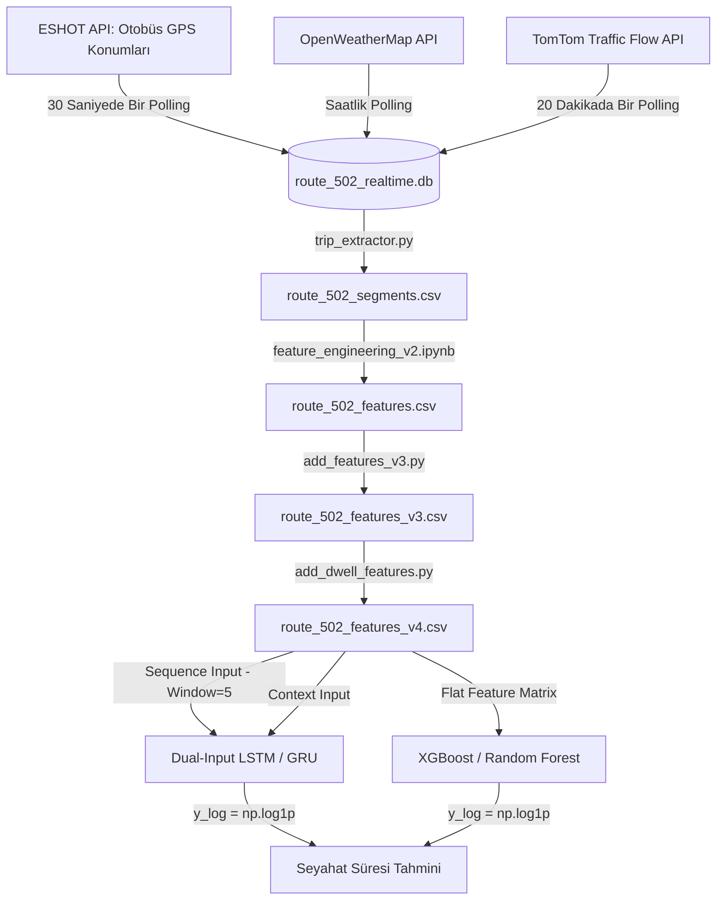

# Proje Analiz Raporu: Bağlam Duyarlı Derin Öğrenme ile Otobüs Varış Süresi Tahmini

Bu rapor, İzmir ESHOT Hat 502 için geliştirilen **Bağlam Duyarlı Derin Öğrenme ile Otobüs Varış Süresi Tahmini** projesinin teknik altyapısını, veri akış hattını (pipeline), makine öğrenmesi modellerinin girdi/çıktı yapısını ve projede tespit edilen eksik/geliştirilebilecek alanları detaylandırmaktadır.

---

## 1. Uçtan Uca Veri Hattı (Data Pipeline)

Sistem, verinin toplanmasından model tahminine kadar 5 temel aşamadan oluşan bir boru hattı (pipeline) yapısını takip etmektedir:

### A. Veri Toplama (Data Ingestion)
- **Modül:** `data_collector/collector.py` ve `data_collector/config.py`
- **İşlev:** 
  - **GPS Verisi:** Her 30 saniyede bir İzmir ESHOT API'sinden 502 (ve 268, 565) hatlarının canlı otobüs konumlarını çeker. Otobüsün durak listesindeki en yakın durağı hesaplanır (Haversine formülü ile). Mesafe $\le 150\text{m}$ ise `arrival` event'i oluşturulur.
  - **Hava Durumu:** Her saatte bir OpenWeatherMap API'sinden sıcaklık, nem, rüzgar, görüş mesafesi ve yağış bilgilerini toplar. (API anahtarı bulunamazsa mock veri üretir).
  - **Trafik Verisi:** Her 20 dakikada bir TomTom Flow Segment API'sinden 502 hattının duraklar arası segment koordinatlarındaki hız ve tıkanıklık oranını (`congestion_ratio`) çeker.
- **Depolama:** Tüm veriler `data_collector/collected_data/route_502_realtime.db` SQLite veritabanına kaydedilir.

### B. Segment ve Sefer Çıkarma (Trip/Segment Extraction)
- **Modül:** `data_collector/trip_extractor.py`
- **İşlev:** `trip_events` tablosundaki durak geçiş verilerini kronolojik olarak işler.
  - Otobüsün durak $i$ ile durak $i+1$ arasındaki geçiş sürelerini çıkartır (`travel_minutes`).
  - 30 dakikadan uzun veri kesintileri veya durak sıralamasının sıfırlanması durumunda yeni sefer (`trip`) ayırımı yapar.
  - Uç değerleri ($0.33 \text{ dk} < \text{travel\_minutes} < 15 \text{ dk}$) temizler.
- **Çıktı:** `collected_data/extracted_trips/route_502_segments.csv` ve `route_502_trips.csv`

### C. Özellik Mühendisliği (Feature Engineering)
Modellerin başarısını artırmak için özellik mühendisliği aşamalı olarak uygulanmıştır:
1. **v2 (Temel Özellikler - `feature_engineering_v2.ipynb`):** GTFS planlı seyahat süreleri (`scheduled_travel_min`), mesafe, zaman encodingleri (sin/cos saat/gün) ve hava durumu bilgileri eklenir.
2. **v3 (Tarihsel ve Lag Özellikleri - `add_features_v3.py`):** 
  - `deviation_minutes`: Gerçek süre - planlanan süre.
  - `cumul_deviation`: Sefer içindeki o ana kadarki kümülatif sapma (data leakage engellemek için `shift(1)` ile önceki adımlar alınır).
  - `rolling_3_deviation`: Son 3 segmentin ortalama sapması.
  - `stop_hist_median` ve `stop_hist_ratio`: Durağın tarihsel medyan süresi (data leakage önlemek adına yalnızca train splitinden hesaplanır).
  - `prev_speed_mpm`: Bir önceki segmentteki otobüs ortalama hızı.
3. **v4 (Dwell Time Özellikleri - `add_dwell_features.py`):**
  - Otobüslerin duraklarda yolcu indirme/bindirme süreleri (`dwell_time_sec`), ham GPS (`bus_positions`) verisindeki durağa $\le 50\text{m}$ yakın durduğu ardışık zaman farklarından türetilir (Min 10 sn, Max 10 dk).
  - `prev_dwell_time_sec` (önceki durağın bekleme süresi) bir sonraki seyahat süresini tahmin etmede güçlü bir girdi sağlar.
- **Çıktı:** `collected_data/route_502_features_v4.csv` (138.282 satır, 40 kolon).

---

## 2. Modellerin Girdi ve Çıktı Yapısı

Projede iki ana model kategorisi kullanılmıştır: Klasik ML modelleri (RF, XGBoost) ve Derin Öğrenme Modelleri (LSTM, GRU).

### A. Hedef Değişken ve Log Dönüşümü
Hedef değişken duraklar arası seyahat süresidir (`travel_minutes`). Sürelerin dağılımı sağa çarpık olduğundan modellerde **Log-Transform** uygulanmıştır:
$$y_{log} = \ln(y + 1)$$
Tahmin yapıldıktan sonra değerler orijinal ölçeğe dönüştürülür:
$$\hat{y} = e^{\hat{y}_{log}} - 1$$
Bu dönüşüm, MAPE değerini belirgin şekilde düşürür ve model kararlılığını artırır.

### B. Dual-Input LSTM / GRU Model Mimarisi
Derin öğrenme modelleri, dizisel verileri ve statik bağlamsal özellikleri ayrı kollardan alan iki kanallı (dual-input) bir yapıya sahiptir:

1. **Sequence Input (Dizi Kolu):**
   - **Girdiler:** `travel_minutes` (lagged), `scheduled_travel_minutes`, `distance_m`, `stop_progress`
   - **Boyut:** `(batch_size, window_size=5, 4)`
   - **İşleme:** 2 katmanlı LSTM veya GRU katmanından (128 unit, dropout=0.2) geçerek son gizli durum (hidden state) vektörünü üretir.
2. **Context Input (Bağlam Kolu):**
   - **Girdiler:** Saat sin/cos, gün tipi, hava durumu bilgileri (sıcaklık, nem, yağış vb.), tarihsel medyanlar (`stop_hist_median`, `stop_hist_ratio`), kümülatif sapma (`cumul_deviation`, `rolling_3_deviation`), hız ve dwell time (`dwell_time_sec`, `prev_dwell_time_sec`).
   - **Boyut:** `(batch_size, 16)` (v4 özellikleri dahil)
   - **İşleme:** Bir Dense katmanından (32 unit, ReLU) geçirilir.
3. **Birleştirme (Concatenation) ve Çıkış:**
   - İki kolun çıktıları birleştirilir `(batch_size, 160)`.
   - Bir Dense katmanından (64 unit, ReLU) geçtikten sonra tek bir linear çıkış katmanı ile tahmin üretilir.
   - **Kayıp Fonksiyonu (Loss):** Büyük aykırı değerlerin gradyanları bozmasını engellemek için `HuberLoss (delta=1.0)` kullanılmıştır.

### C. Stacking Ensemble (Meta-Model)
- **Bileşenler:** Selective Trend + Enhanced XGBoost + LSTM predictions
- **Meta-Model:** Ridge Regression. Alt modellerin tahminlerini ağırlıklandırarak tek bir çıktı üretir.
- **Bulgu:** 138K veri kümesinde Stacking performansı, tek başına çalışan LSTM modelini geçememiştir (Stacking MAE 0.50 dk vs LSTM MAE 0.41 dk).

---

## 3. Projedeki Eksik ve Geliştirilebilir Alanlar

Yapılan derinlemesine inceleme ve kod analizleri sonucunda projede tamamlanması veya optimize edilmesi gereken şu alanlar tespit edilmiştir:

### 🟥 Yüksek Öncelikli Eksikler
1. **İstatistiksel Anlamlılık Testlerine Derin Öğrenmenin Eklenmemesi:**
   - *Mevcut Durum:* `evaluation.ipynb` içindeki paired t-test ve Wilcoxon testleri LSTM ve GRU modellerini içermemektedir. Testler yalnızca Random Forest ve XGBoost arasında yapılmaktadır.
   - *Çözüm:* Test dosyasındaki sequence yapıları kurulup LSTM/GRU tahminleri de test suite dahil edilmeli, en iyi model olan LSTM'in istatistiksel üstünlüğü formal olarak kanıtlanmalıdır.
2. **Demo Arayüz Entegrasyonu:**
   - *Mevcut Durum:* Demo dashboard **yok**. (Eski `scripts/web_dashboard.py` güncel modele hiç bağlanmamıştı ve 2026-06-05 refaktöründe silindi.) Demo sıfırdan, `models/improved_lstm*.pt` üzerine kurulmalı. Sunum ve teslim aşamasında canlı demo gösterimi zayıf kalabilir.
   - *Çözüm:* Dashboard scripti LSTM modeline bağlanmalı, durak bazlı `GET /predict` API'si entegre edilmelidir.
3. **Akademik Rapor / Tezin Kapatılması:**
   - *Mevcut Durum:* Teknik pipeline tamamen hazır ve leakage düzeltmeleriyle doğrulanmış durumdadır, ancak bu çıktıyı toparlayacak akademik yazı taslağı tamamlanmamıştır.

### 🟨 Orta Öncelikli Geliştirmeler
4. **Hat Başlangıcı "Cold-Start" Hatası:**
   - *Sorun:* Analiz sonuçlarına göre ilk 3-5 durakta (hattın ilk %33'lük bölümünde) seyahat süresi tahmin hatası (MAE) orta ve son kısımlara göre **2 kat daha kötüdür** (0.83 dk vs 0.41 dk). Bunun nedeni trip başında lag özelliklerinin (`prev_travel_time_min`, `prev_deviation`) `0` olmasıdır.
   - *Çözüm:* Trip başında `0` atamak yerine, o durağın **tarihsel grup ortalaması** (historical mean) ile doldurma yapılmalı veya modele `is_trip_start` gibi bağlamsal bir flag eklenmelidir.
5. **Yağışlı/Karlı Hava Durumu Veri Eksikliği:**
   - *Sorun:* 27 günlük veri toplama sürecinde yalnızca `clear` ve `cloudy` hava gözlemlenmiştir. Yağışlı/karlı veri olmadığı için hava durumu özellikleri modele gürültü eklemekte ve model performansını düşürmektedir (ablasyon çalışmasında hava özellikleri çıkarıldığında MAE 0.5064'ten 0.4818'e düşmektedir).
   - *Çözüm:* Kış döneminde veri toplama uzatılmalı ya da bu durum raporda açıkça "yağışlı hava verisi olmaması nedeniyle hava durumu özelliklerinin gürültü yaratması" şeklinde dürüstçe belgelenip "limitations" kısmına eklenmelidir.
6. **LSTM Hiperparametre Optimizasyonu:**
   - *Sorun:* Modelde `window_size=3` (veya improved scriptte 5) ve `dropout=0.2` gibi sabit değerler kullanılmıştır. Geniş bir sweep yapılmamıştır.
   - *Çözüm:* Optuna veya Random Search ile window size (3, 5, 7) ve LSTM katman genişlikleri optimize edilerek MAE 0.41'in altına çekilebilir.

### 🟩 Düşük Öncelikli Geliştirmeler
7. **Dwell Time Entegrasyonunun Yaygınlaştırılması:**
   - *Mevcut Durum:* GPS verilerinden hesaplanan `dwell_time_sec` v4 özellikleri sadece Random Forest modeli üzerinde denenmiş ve MAE'yi %3.7 iyileştirmiştir.
   - *Çözüm:* v4 veri seti Improved LSTM ve XGBoost eğitimlerinde de standart hale getirilerek tüm modellerde genel bir MAE iyileşmesi sağlanabilir.
8. **SHAP beeswarm ve force plot grafiklerinin** en güncel leakage'sız modeller için yeniden üretilmesi.
